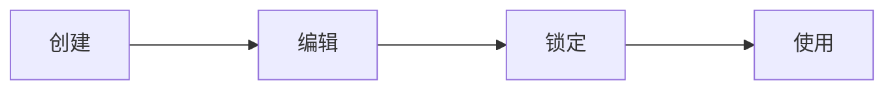
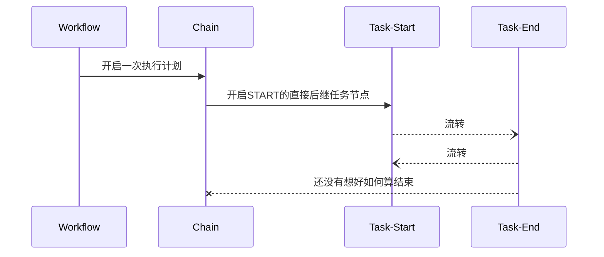
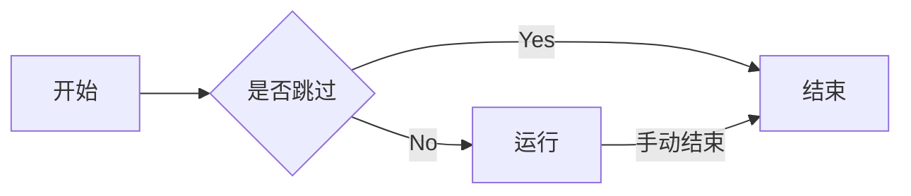
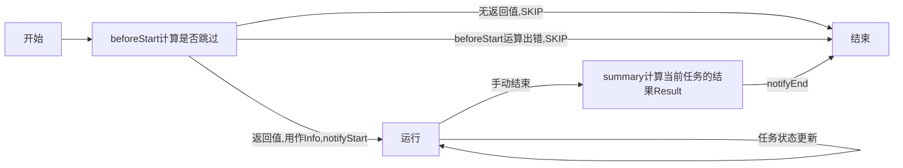

---
# try also 'default' to start simple
theme: default 

# show line numbers in code blocks
lineNumbers: true
css: unocss
layout: center
---

# workflow-backend 构思

- 针对基于[react-flow](https://reactflow.dev/)所定制的workflow图，需要给出具体的执行逻辑
- 不应该假定当前程序所运行的具体环境，需要考虑在浏览器环境下的全功能运行
- 不应该对节点的具体类型做任何限制


---
layout: center
---

# 当前设计

当前设计基于内容可以分为3个部分：

- 负责核心流程逻辑的core包
- 负责数据存取逻辑的adapter
- 负责具体业务拓展的task strategy

其中后两者通过core包提供的相应接口与core包相互接合，形成完整的应用实例。

---
---

# core - 实体定义 - Workflow

定义：具体的流程图，在react-flow的基础上附加业务信息组合而成

对应ts类型如下：

```ts
export type Workflow = {
  id: WorkflowId;

	// 由前端workflow的编辑页面使用
  nodes: any[]; // 节点

  edges: any[]; 

  alias: Record<string, NodeId>; // 别名对照

	// 在workflow锁定后自动生成，用于任务链的流转阶段。
  compliedInfo: CompliedInfo | null;
};
```
<div className="text-3">
在业务流程中，workflow表示用户自定义的流程模版。workflow的compliedInfo对象的有无指示着当前模版是否已被锁定。用户只能编辑未锁定的workflow，与之对应也只能使用已被锁定的workflow。从用户角度，workflow的生命周期为：
</div>



---
---
# core - 实体定义 - Chain

定义：工作流模版的实例，即流程模版的一次执行过程。


---
---
# core - 实体定义 - Task

定义：一次执行过程中，任务流模版的一个节点的具体实例。即流程执行过程中某一项具体的子任务。

其相应的ts类型如下：

```ts {4-5|7-8|10-12|8-19|all} {maxHeight: '330px'}
type Task<Type extends string, Info = any, Detail = any, Result = any> = {
  id: TaskId;

  workflowId: WorkflowId;
  nodeId: NodeId; // workflow中对应的node

  chainInfo: Record<Alias,ResultPointer>; // 祖先节点的别名和其Result的对应关系
	chainId: ChainId;

  info?: Info;     // 任务开启后任务的具体信息
  detail?: Detail; // 任务过程中的中间信息
  result?: Result; // 当前任务的执行结果

  type: Type;

  alias?: string;  // 等于workflow中对应node的alias

  status: 'RUNNING' | 'SKIP' | 'END';
	errorMsg?:string; // 在开启任务的时候的错误信息
};
```

---
---
# core - 实体定义 - Task属性

- 通过Info，Detail，Result三个维度来支持Task的多态
- chainInfo间接记录了当前任务所有前继节点的执行结果（Result）
- alias是当前Task对应Node的冗余项。
- status用来指示当前任务的具体状态
  - RUNNING：正在运行
  - SKIP：因为错误或条件不满足而跳过
  - END：已经结束

---
---

# core - 实体定义 - Task生命周期

从单个任务的状态变化角度，可以观察到合法的转变有且仅有以下几种：

1. 无->RUNNING(开启任务)
2. 无->SKIP(跳过任务)
3. RUNNING->END(正常结束任务)




---
---

# core - 核心流程 - endTask

在默认情况下，为了流程的自动流转，我们可以将状态1，2（即任务的创建和跳过）与其前继节点的结束同步执行。至此，我们可以获得第一个核心流程-结束当前任务并开启所有后继节点。

```ts
function endTask(){
	// 1. 结束当前任务
	// 2. 遍历所有后继节点，开启或跳过各个节点
}
```

> 手动开启任务的过程可以被分解为任务自动跳过+手动开启任务的状态更新。

---
---

# core - 核心流程 - startWorkflow

开启工作流，逻辑与endTask类似，只是将结束当前任务转变为创建新的流程实例

```ts
function startWorkflow(){
	// 1. 创建新的Chain实例
	// 2. 遍历所有后继节点，开启或跳过各个节点
}
```

<v-click>
至此，core所负责的所有逻辑已经展示完毕，接下来，让我们聚焦于如何core如何提供拓展机制来提供其灵活性。
</v-click>


---
---

# core - Task类型拓展 

Task类型的多样性体现在以下方面

- 关联的数据类型不同
  - 
  - 任务开启时的信息 - Info
  - 任务进行时的中间数据 - Detail
  - 任务结束时的输出- Result
- 任务在自身生命周期会执行不同的策略
- 任务在开启和关闭的时候需要发出不同的通知

解决方案：

- 使用Info,Detail和Result三个类型变量来支持关联类型的多样性
- 对在任务的生命周期埋下hook来辅助策略

---
---
# core - Task生命周期拓展

对应的ts类型
```ts {all} {maxHeight: '250px'}
export type TaskStrategy<
  Type extends string = any,
  Info = any,
  Detail = any,
  Result = any,
  TemplateInfo = any,
> = {
  type: Type;

  beforeStart: (v: { TemplateInfo: any; ctx: ChainContext }) => Info | null; // null 指代skip

  notifyStart: (v: {
    chainId: ChainId;
    nodeId: NodeId;
    workflowId: WorkflowId;
    info: Info;
  }) => Promise<void>; // 其中的报错会被抑制住，不影响流程

  summary: (v: {
    info: Info;
    detail: Detail;
    ctx: ChainContext;
    requestBody: any;
  }) => Promise<Result>;

  notifyEnd: (v: {
    info: Info;
    detail: Detail;
    ctx: ChainContext;
    requestBody: any;
  }) => Promise<void>; // 其中的报错会被抑制
};

```

---
---
# core - 内置Task 

### If

说明：workflow编辑对象输入合法js表达式所定义的字符串，该节点的后继节点只会在表达式返回Truthly的值时执行。

```ts
type TemplateInfo = string;
type Info = string; // 需要时合法js表达式
type Result = boolean;
type Detail = any;
```

### SubWorkflow (暂未实现)

说明：可以将整个个workflow当作一个任务节点，这允许了workflow的嵌套执行。


---
---

# 没有想好的问题
- 是所有任务都抵达执行或跳过才算终节点结束吗
- End节点是不是需要计算状态值
- 如何定义Chain的结束状态
  


